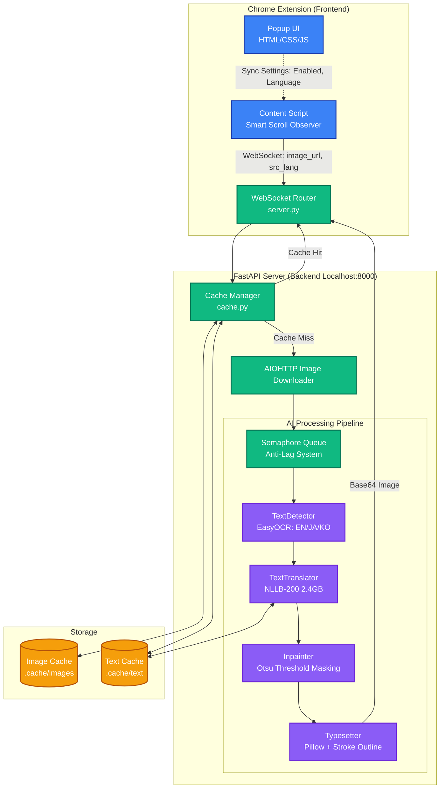
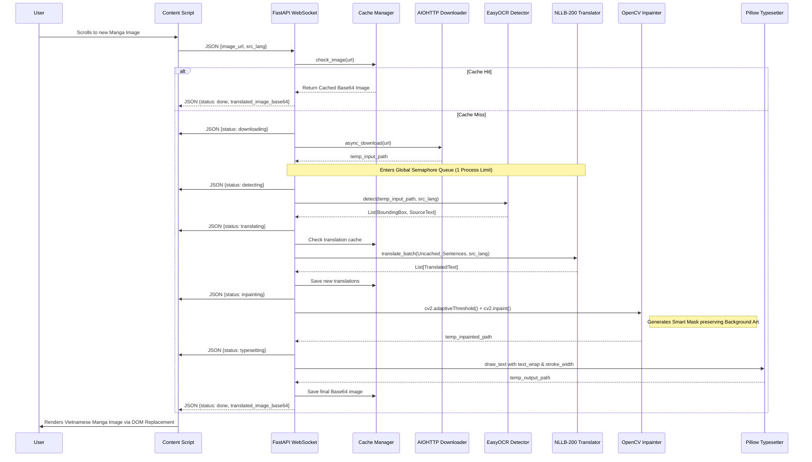
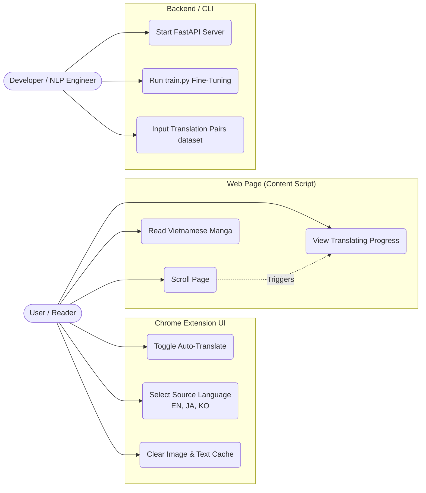

# Manga Translator AI - Architecture Diagrams

This document illustrates the exact architecture, data flows, and use cases of the **Manga Translator AI** project. All diagrams reflect the 100% current and real Python/JavaScript codebase implementations.

---

## 1. System Architecture Diagram

This macro-level diagram shows the relationship between the Browser Extension and the Python Backend Server.

---

## 2. Sequence Diagram: Data Pipeline Workflow

This sequence diagram depicts the detailed chronological workflow of a single image translation request triggered by the user scrolling the web page.

---

## 3. Use Case Diagram

This diagram maps out the core user actions across the Extension and the Backend.

---

## Technical Highlights

The diagrams above strictly reflect the real architecture found in this repository. Specifically:
- **WebSocket (`server.py`)**: Uses `asyncio.Semaphore(1)` to prevent RAM exhaustion on low-end CPUs while supporting asynchronous background downloads.
- **Smart Masking (`pipeline/inpaint.py`)**: Demonstrates the usage of `cv2.adaptiveThreshold` + `cv2.bitwise_and` combined with `cv2.INPAINT_TELEA`.
- **Text Typesetting (`pipeline/typesetter.py`)**: Wraps text boundaries and uses `stroke_width` and `stroke_fill` to ensure visibility.
- **Offline ML (`pipeline/detector.py` & `pipeline/translator.py`)**: Showcases `EasyOCR` lazy loading and `transformers` offline model loading of `nllb-200-distilled-600M` using `torch.no_grad()`.
